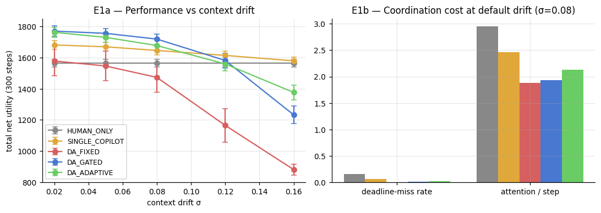

# DistAgency-Lab

**A Computational Testbed for *Distributed Agency* in Human–AI Hybrid Teams**

[](https://colab.research.google.com/github/Diptikanta2805/cursor-test/blob/main/distributed_agency_lab.ipynb)

Based on the conceptual article *“Leadership and Coordination in Human-AI Hybrid Teams: A
Distributed Agency Approach”* (V. F. He, UCL). The paper proposes that each human "principal"
should lead a portfolio of AI representations tuned along **Fidelity–Autonomy–Scope (F-A-S)**
dimensions, governed by **Delegation Contracts**, **staleness/novelty gating**, **progressive
autonomy**, and **inner-crowd wisdom** — but provides no formal model, data, or tests.

This project contributes:

| # | Contribution |
|---|---|
| N1 | First **mathematical formalization** of the framework (drifting context, epistemic alignment, executable delegation contracts) |
| N2 | **Agent-based simulation** testing the paper's propositions P1–P5 against controlled baselines (human-only team, single generic copilot), with CIs over seeds |
| N3 | **Adaptive Delegation Controller (ADC)** — a novel evidence-driven feedback law that *learns* each representation's update rate online and re-adapts after regime shifts (the open problem the paper leaves to "leader judgment") |
| N4 | Operational **Divergence Index** + derived **inverted-U** inner-crowd-wisdom curve |
| N5 | **Shock-recovery event study** of the staleness-gating safety mechanism ("Northstar Tuesday") |
| N6 | **Endogenous trust dynamics** coupling agent errors / hand-backs to team throughput |

## Repository contents

| File | Description |
|---|---|
| `paper_analysis.md` | Extraction of the paper: research question, methodology, data, variables, model, metrics, results — and the gaps this project fills |
| `implementation_plan.md` | Step-by-step implementation plan, formal model equations, experiment design |
| `distributed_agency_lab.ipynb` | **The project** — self-contained Colab notebook (pre-executed, all figures embedded) |
| `distributed_agency_lab.py` | Identical content as a jupytext percent script (for local runs / review) |
| `figures/` | Key result figures (E1–E5) generated by the notebook |

## Run it

**Colab (recommended):** click the badge above → `Runtime ▸ Run all`. Zero installs
(NumPy / pandas / Matplotlib only), ≈ 2 min on a free CPU runtime.

**Locally:**

```bash
pip install -r requirements.txt
python distributed_agency_lab.py        # or: jupyter notebook distributed_agency_lab.ipynb
```

## Headline results (means over 20 seeds, default drift)

| Condition | Total net utility | Miss rate | Attention/step | Failures | Final trust |
|---|---|---|---|---|---|
| HUMAN_ONLY | 1564 | 15.7% | 2.95 | 0 | 1.00 |
| SINGLE_COPILOT | 1646 | 6.3% | 2.46 | 3.8 | 1.00 |
| DA_FIXED (naive) | 1473 | 0.6% | 1.88 | 10.7 | 0.59 |
| **DA_GATED (paper)** | **1719** | 0.8% | 1.93 | 2.4 | 0.99 |
| DA_ADAPTIVE (ours) | 1678 | 2.1% | 2.13 | 4.4 | 0.99 |

- Governed distributed agency beats the status quo and the single-copilot setup; **ungoverned**
  portfolios fall *below* the human-only baseline (governance is the value, not the agents).
- Inner-crowd option quality is **inverted-U** in the Divergence Index (curate, don't maximize).
- After a context shock, staleness gating cuts post-shock failures from ~5.5 to ~0.1 per run.
- Across a calm→turbulent regime shift, the **ADC** re-learns the update rate online (mean
  fidelity 0.26 → 0.64), reaches ~97% of the best fixed profile *without knowing the regime*,
  and beats hand-tuned profiles on average.



## Optional LLM bridge

Section 8 of the notebook demonstrates the pre-negotiation protocol with real LLM liaison agents
(disclosure banners + machine-readable Delegation Contracts). It runs only if `OPENAI_API_KEY`
is set and is skipped gracefully otherwise — all simulation results are fully self-contained.
